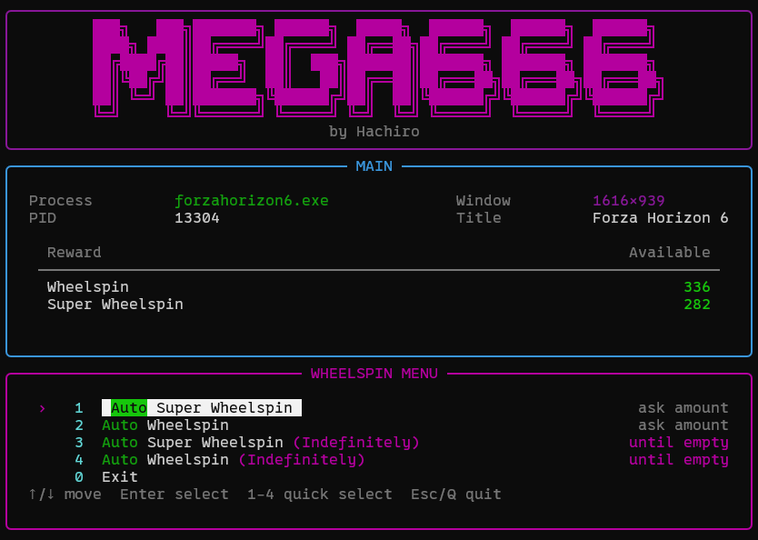

# MEGA666 - yet another FH6 Auto WheelSpin Bot



OCR-based wheelspin helper for Forza Horizon 6. It finds the game, reads the available Wheelspin and Super Wheelspin counts and can automate rolling them in the background using low-level window and input automation. One of its strongest points is that it can keep running in a windowed, low-resolution game window without using much system resources.

> Important: if you run the game in windowed mode and there are black bars around the game window, the bot might not work. Make sure to resize properly until no black bars seen.


## Requirements

- Python 3.10+
- Forza Horizon 6 running in a visible, non-minimized window

## Install

Clone the repository first:

```sh
git clone https://github.com/HachiroSan/fh6-autowheelspin
cd fh6-autowheelspin
```

Using Python:

```sh
pip install -e .
```

Using `uv`:

```sh
uv venv
uv pip install -e .
```

## Run

Start the game first, open My Horizon tab, then run:

The bot can keep working while the game runs in the background, as long as the window stays open and not minimized. Windowed mode at a lower resolution can help reduce resource usage.

```sh
mega666
```

Or, if installed with `uv`:

```sh
uv run mega666
```

## Auto resize

If OCR cannot read the counts clearly, run with auto-resize:

```sh
uv run mega666 --auto-resize
```

Or, if installed with Python:

```sh
mega666 --auto-resize
```

The auto-resize option will automatically find the working size.

## Contributing

- Open an issue or discussion first if you want to change behavior or add a feature.
- Keep pull requests focused on one change at a time.
- Include a clear summary of what changed and how you tested it.
- If you add code, run the relevant checks before opening a PR.

## Disclaimer
This project is only for educational purposes.
